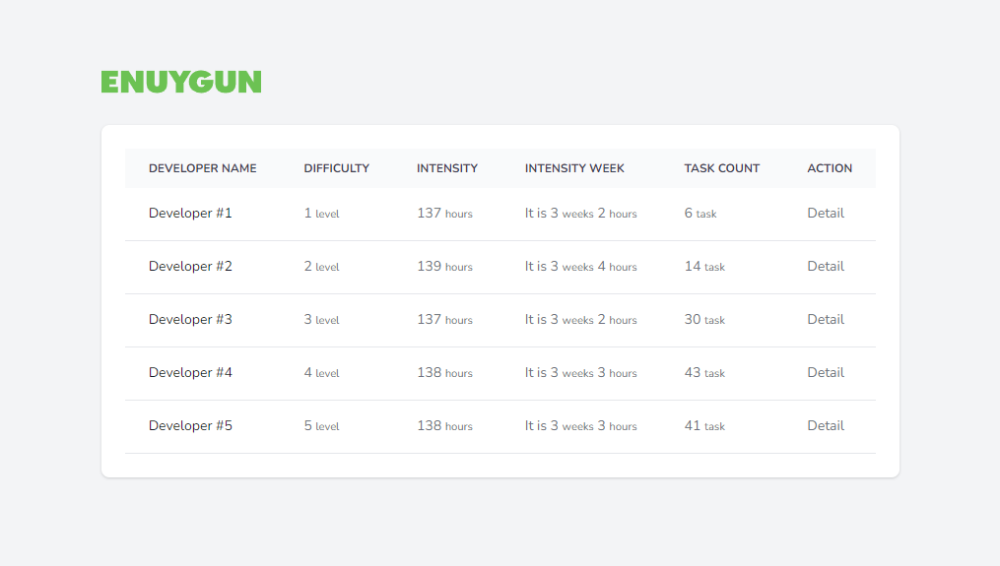

Selamlar,

Ben Yasin, bu repo Wingie Enuygun ekibi tarafından 25.01.2023 16:57 tarihinde teslim aldığım task için açılmıştır.

# Kişisel Timeline

- 25.01.2023 16:57 - Task teslim alındı
- 26.01.2023 02:45 - Case çözüm sürecinin başlangıcı
- 26.01.2023 05:08 - Gün sonu, biraz mola
- 26.01.2023 17:20 - Front oluşturmak üzere kaldığım yerden devam
- 26.01.2023 17:56 - Front dahil hepsi tamamlandı

# Kurulum

Aşağıdaki kodları sırasıyla uygularsanız başarıyla kurulum tamamlanır.

```bash
$ git clone https://github.com/YasinKose/wingie-enuygun-case.git
$ cd wingie-enuygun-case
$ docker compose build
$ docker compose up -d
$ docker compose exec app cp .env.example .env
$ docker compose exec app composer install
$ docker compose exec app php artisan key:generate
$ docker compose exec app chmod -R 777 storage bootstrap/cache
$ docker compose exec app php artisan migrate:fresh --seed
$ docker compose exec app php artisan seed:task
```

- Terminal üzerinde herhangi bir komut çalıştırmak için şu iki yolu izleyebilirsiniz;

```bash
$ docker compose exec app #istenen komut buraya
```

veya

```bash
$ docker compose exec app sh
$ #Bu bash aracılığıyla docker içerisine terminal bağlantısı açılır, istenen kodlar buraya girilebilir.
```

Not: Kurulum tamamlandıktan sonra host dosyasına aşağıdaki gibi domain kaydı sağlamalısınız;

```
127.0.0.1   enuygun.test
127.0.0.1   phpmyadmin.test
```

# Ekran görüntüleri

- http://enuygun.test/developers
  

- http://enuygun.test/developers/1
  

# PhpMyAdmin Erişim

http://phpmyadmin.test/ adresine gidin ve şu bilgileri kullanın;

```
Server: mysql-app
Username: root or enuygun
Password: secret
Database: laravel
```
